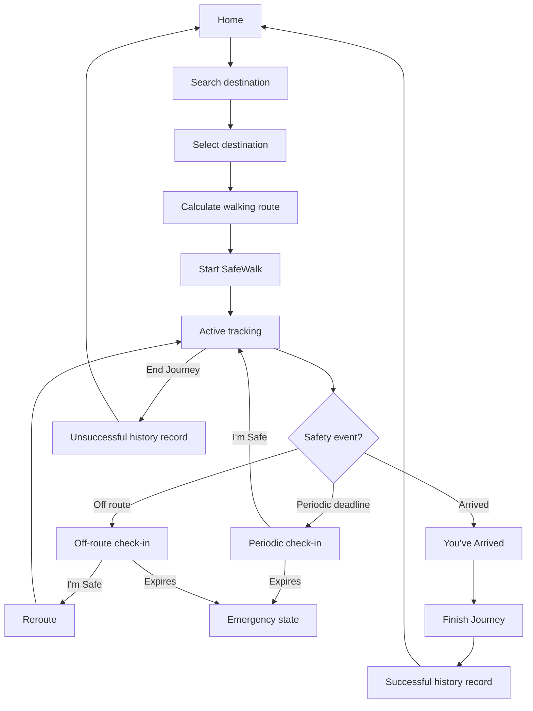
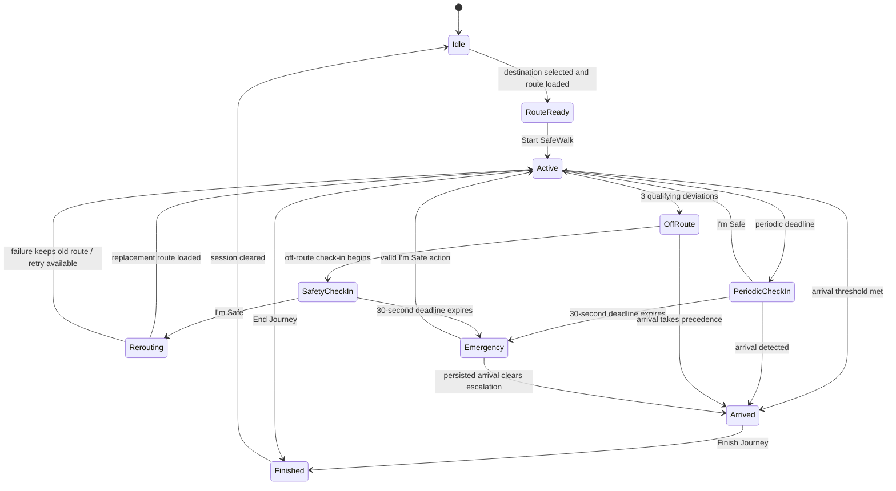
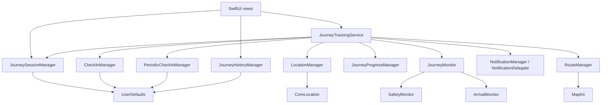

# SafeWalk

**A safety-oriented walking companion built with native Apple technologies.**

SafeWalk combines walking directions with route awareness, timed safety check-ins, local notifications, emergency options, interruption recovery, and an on-device journey history. It is designed to keep the context of a walk intact while the app moves between the foreground, background, and a later launch.

> SafeWalk is a safety aid. It does not guarantee personal safety and is not a replacement for emergency services.

## Overview

A SafeWalk journey starts with a destination and a MapKit walking route. During the journey, the app follows location updates, estimates progress, checks whether the user has moved away from the planned route, and schedules periodic safety confirmations. If a check-in is missed, SafeWalk retains an emergency state and presents user-initiated contact and location-sharing options.

In this project, a **journey** is the complete state associated with one monitored walk: its destination, start time, planned distance, route changes, check-in state, emergency state, and arrival state. The active journey is persisted separately from the route object because `MKRoute` itself is runtime data. After an interruption, SafeWalk reconstructs the route from the stored destination and the user's current location.

## Problem statement

Walking alone can involve more than finding directions. A route deviation may go unnoticed, a person may forget to send a manual update, and the relevant context can disappear if an app is terminated. Navigation alone does not provide proactive safety prompts or retain the status of an unresolved safety event.

SafeWalk addresses that gap with a focused workflow. It keeps the selected destination and journey state available, asks for confirmation at defined points, escalates a missed response inside the app, and preserves enough context to recover after interruption. Its role is to support the user's awareness and communication; it cannot determine whether a person is safe.

## Design goals

- Use native iOS controls and Apple frameworks for a familiar experience.
- Keep journey and emergency state resilient across app termination.
- Make safety interactions direct and understandable during a walk.
- Maintain one stable planned route until a confirmed off-route event requires a replacement.
- Reduce the actions required while a journey is active.
- Keep journey, contact, and history data on the device in the current implementation.
- Separate route monitoring, arrival detection, check-ins, and persistence so each responsibility remains explicit.

## Key features

| Feature | Implemented behavior |
| --- | --- |
| Destination search | Uses `MKLocalSearch`, cancels replaced searches, limits displayed results, and supports retry after an error. |
| Walking directions | Requests an `MKDirections` route with walking transport and renders the route in a SwiftUI map. |
| Journey tracking | Processes filtered Core Location updates while an active journey is being monitored. |
| Progress | Tracks remaining distance and an estimated completion percentage against the current route baseline. |
| Off-route detection | Measures the user's shortest distance from the route's polyline segments and requires repeated deviations before triggering. |
| Safety check-ins | Shows a reason-aware 30-second confirmation with an **I'm Safe** action. |
| Periodic check-ins | Maintains a 60-second development interval using an absolute persisted deadline. |
| Local notifications | Presents route and periodic check-ins and exposes an **I'm Safe** notification action. |
| Emergency escalation | Persists a missed-check-in state and offers user-initiated contact, sharing, and emergency-call actions. |
| Rerouting | Recalculates only after the user confirms an off-route check-in; preserves the old route on failure. |
| Background location | Enables Core Location background updates when Always authorization is available and the target's location background mode is active. |
| Restoration | Restores active journeys, check-ins, periodic deadlines, emergency state, and arrived-but-unfinished journeys. |
| Arrival | Detects arrival within 50 metres when horizontal accuracy is also 50 metres or better. |
| History | Stores successful and manually ended journey records locally and supports deletion. |

## User journey



## Safety state machine

The code represents this lifecycle through coordinated manager state rather than a single state enum. The following diagram describes the valid product states and transitions.



`Arrived` is a terminal safety-monitoring state for the current session. The record is saved and the session is cleared only after the user presses **Finish Journey**.

## Architecture

SafeWalk uses SwiftUI environment objects for the two shared journey-level objects. `SafeWalkApp` creates one `JourneySessionManager`, passes that exact instance to `JourneyTrackingService`, and injects both into the view hierarchy. This ensures views and runtime services observe the same persisted session.



`JourneyTrackingService` is the coordinator. It connects location updates to monitoring and progress, starts and restores check-in cycles, responds to arrival, owns reroute requests, and stops resources when the journey ends. The specialized managers retain their existing focused responsibilities.

## Core components

| Component | Responsibility |
| --- | --- |
| `SafeWalkApp` | Creates and injects the shared session and tracking service; configures notification handling. |
| `ContentView` | Home screen, destination entry point, active/arrived journey restoration, contact settings, and history links. |
| `JourneyView` | Route planning, active journey UI, check-in and emergency presentation, arrival completion, and manual finish actions. |
| `JourneySessionManager` | Persists the identity and durable state of the current journey. |
| `JourneyTrackingService` | Coordinates runtime tracking, restoration, safety events, arrival cleanup, and rerouting. |
| `LocationManager` | Manages authorization, location quality filtering, foreground updates, and permitted background updates. |
| `JourneyMonitor` | Runs arrival first, then off-route evaluation for each accepted location. |
| `SafetyMonitor` | Calculates shortest distance to route segments and debounces off-route detection. |
| `ArrivalMonitor` | Applies the arrival distance and accuracy criteria and locks duplicate arrival events. |
| `CheckInManager` | Runs and persists a 30-second reason-aware check-in deadline. |
| `PeriodicCheckInManager` | Runs and persists the next periodic deadline and waits for each check-in to resolve. |
| `RouteManager` | Calculates, cancels, and retries walking routes while rejecting stale responses. |
| `DestinationSearch` | Performs cancellable local search with stale-result protection and retry state. |
| `JourneyProgressManager` | Calculates distance remaining and journey progress against the monitored route. |
| `NotificationManager` | Registers categories and schedules journey-bound local notifications. |
| `NotificationDelegate` | Presents foreground notifications and forwards the notification **I'm Safe** action. |
| `JourneyHistoryManager` | Encodes, stores, deletes, and deduplicates `JourneyRecord` values. |
| `EmergencyView` | Presents emergency context and user-initiated contact, location sharing, and emergency calling. |

## Project structure

```text
SafeWalk/
├── README.md
├── FINAL_TEST_CHECKLIST.md
├── SafeWalk.xcodeproj/
└── SafeWalk/
    ├── SafeWalkApp.swift
    ├── ContentView.swift
    ├── DestinationSearch.swift
    ├── DestinationSearchView.swift
    ├── JourneyView.swift
    ├── MapView.swift
    ├── RouteManager.swift
    ├── LocationManager.swift
    ├── JourneyTrackingService.swift
    ├── JourneySessionManager.swift
    ├── JourneyMonitor.swift
    ├── SafetyMonitor.swift
    ├── ArrivalMonitor.swift
    ├── CheckInManager.swift
    ├── PeriodicCheckInManager.swift
    ├── JourneyProgressManager.swift
    ├── NotificationManager.swift
    ├── NotificationDelegate.swift
    ├── EmergencyView.swift
    ├── EmergencyContactView.swift
    ├── ContactPicker.swift
    ├── MessageComposer.swift
    ├── JourneyHistoryManager.swift
    ├── JourneyHistoryView.swift
    ├── Info.plist
    ├── PrivacyInfo.xcprivacy
    └── Assets.xcassets/
```

The views provide the interaction layer. Managers and monitors contain routing, location, safety, and persistence behavior. Project settings supply generated location-purpose strings, while `Info.plist` declares the location background mode.

## Routing

`DestinationSearch` uses `MKLocalSearch` with the user's natural-language query. An empty query is rejected with an actionable message. A newly submitted query cancels the previous search, and identity checks prevent a late result from replacing newer results.

`RouteManager` builds an `MKDirections.Request` from the current location to the selected `MKMapItem` coordinate and sets `transportType` to `.walking`. A new calculation cancels the outstanding directions object. The manager retains the prior coordinates for retry and uses request identity to ignore late callbacks.

The route displayed and monitored during a journey is intentionally stable. GPS updates change the user's position and progress; they do not continually replace the planned route.

## Off-route detection

`SafetyMonitor` converts the user coordinate and route polyline to `MKMapPoint` values. It projects the user point onto each polyline segment and uses the shortest resulting distance. Measuring against segments matters because a user may be close to the path while far from every individual route vertex.

A reading is off route when the shortest distance exceeds 100 metres. Three consecutive qualifying readings are required before `isOffRoute` becomes true. Incoming locations are separately rejected when their horizontal accuracy is invalid or worse than 100 metres, reducing false events from poor GPS samples.

## Safety check-ins

`CheckInManager` records a `CheckInReason` of either `offRoute` or `periodic`, an absolute expiration date, active state, and expiry state. Each check-in has a 30-second response window.

When the user confirms safety, `JourneyTrackingService` captures the reason before clearing the check-in. That order is required because only an off-route confirmation should begin a reroute. A periodic confirmation simply schedules the next periodic cycle. Expiry keeps the reason available for restoration and emergency context.

## Periodic safety checks

`PeriodicCheckInManager` currently uses a 60-second interval. It persists whether the cycle is running and the absolute date of the next check-in. On backgrounding, its in-process timer is invalidated without moving the deadline. On foregrounding or restoration, it compares the stored date with the current time and resumes or triggers the due check-in.

If termination occurs after the periodic deadline has triggered but before its associated check-in is connected again, the coordinator reconciles the persisted periodic and check-in states. This prevents a running cycle with no deadline from remaining stuck.

## Emergency escalation

When a check-in deadline expires, `didExpire` becomes true, the journey session persists emergency escalation, and a missed-check-in notification is scheduled for the deadline. The emergency screen can call the saved trusted contact, share the current location through the system share sheet, compose a message, or start an emergency-services call. These actions require the user to choose them.

SafeWalk does **not** automatically contact a trusted person, send an SMS, or call emergency services. It has no server-based monitoring or dispatch service. Confirming safety clears the unresolved check-in and emergency state when the action belongs to the current journey.

## Notifications

`NotificationManager` registers one check-in category containing **I'm Safe** and **Open SafeWalk** actions. Off-route, periodic, and missed-check-in notifications use that category. `NotificationDelegate` displays banners and sounds in the foreground and forwards safety confirmations to the shared tracking service.

Each actionable notification carries the current journey UUID. The coordinator accepts **I'm Safe** only when the app still has that same active journey, it has not arrived, and an unresolved check-in or emergency event exists. This prevents actions from an older, ended, or arrived journey from changing current state. The same `confirmSafe()` path handles in-app and notification actions.

## Rerouting

The reroute sequence is deliberate: an off-route event starts a check-in, the user confirms safety, and only then does `JourneyTrackingService` request a replacement route. Periodic confirmations never reroute.

The old route remains displayed and monitored while MapKit calculates. A failed calculation keeps that route and exposes retry state. On success, SafeWalk replaces the displayed route, switches `JourneyMonitor` to it, updates the progress baseline, increments persisted reroute metadata, and clears the pending-reroute marker. Cancellation and tracking/arrival guards prevent a late response from resurrecting navigation after completion.

## Arrival detection

`ArrivalMonitor` considers both distance and accuracy. Arrival requires the user to be within 50 metres of the destination and the location's horizontal accuracy to be 50 metres or better. An internal lock prevents repeat arrival events.

For each accepted update, `JourneyMonitor` checks arrival before route deviation. A location that qualifies as arrival therefore cannot start an off-route check-in on the same update. Once arrival is observed, the coordinator persists arrival first and then stops check-ins, periodic scheduling, notifications, rerouting, route monitoring, progress updates, and location updates.

## Arrival persistence

Arrival does not immediately delete the journey:

```text
arrival detected
→ JourneySessionManager.hasArrived = true
→ session saved
→ safety and navigation runtime stopped
→ app may terminate
→ session loads with hasArrived = true
→ completion screen is restored
→ user presses Finish Journey
→ one successful history record is stored
→ persisted session is cleared
```

`JourneyView` uses `sessionManager.hasArrived` as the durable source for completion UI. During an arrived cold launch, it does not request a fresh location or restart monitoring. Keeping this state until explicit finish avoids interpreting a completed walk as an ordinary active journey and accidentally restarting safety behavior.

## Journey persistence

`JourneySessionManager` stores the active session in `UserDefaults`. Values are validated on load; a malformed or incomplete active journey is cleared rather than exposed as resumable. Older valid sessions without a journey UUID receive one during migration.

| State | Persisted | Purpose |
| --- | --- | --- |
| Active flag and journey UUID | Yes | Identifies one resumable journey and its related notifications/history. |
| Destination name and coordinate | Yes | Restores context and recalculates a runtime route. |
| Start date and last update | Yes | Preserves journey timing and session recency. |
| Original/current planned distance | Yes | Preserves history metadata and reroute baseline. |
| Rerouted flag and count | Yes | Describes route changes. |
| Off-route/check-in/expiry summary | Yes | Preserves history metadata across termination. |
| Pending reroute | Yes | Defers a confirmed off-route reroute until tracking can resume. |
| Emergency escalation | Yes | Restores unresolved emergency UI. |
| Arrival | Yes | Restores completion without restarting monitoring. |
| `MKRoute` object | No | Recalculated from current location and destination on resume. |

## Check-in persistence

The check-in manager stores the active flag, reason, expiration date, and expiry state. On restoration, it calculates remaining time from the expiration date. If the deadline has passed, the event restores as expired.

An absolute deadline is necessary because an in-memory decrementing counter stops when the process is suspended or terminated. Comparing wall-clock dates lets SafeWalk reconstruct the meaningful state without pretending that a timer ran continuously.

## Journey history

`JourneyRecord` contains an ID, destination, start and end dates, planned distance, completion result, off-route occurrence, check-in occurrence, and check-in expiry. Arrival completion writes `completedSuccessfully = true`; manual end writes `false`.

The active journey UUID becomes the history record UUID. Repeating a finish action with the same ID is idempotent, so an observer or interrupted finish cannot create a duplicate record. History is JSON encoded into `UserDefaults`, loaded on manager initialization, displayed newest first, and deletable from the history view.

## Background behavior

The target declares the Core Location background mode. `LocationManager` enables `allowsBackgroundLocationUpdates` only with Always authorization. It stops updates and disables that flag after manual end or arrival, and authorization callbacks respect whether tracking is still requested.

iOS controls process lifetime and background execution. SafeWalk does not promise a continuously running Swift timer in the background. Instead, it persists absolute check-in deadlines, schedules local notifications for an active check-in deadline, and reconciles state when the app becomes active or launches again.

## Privacy

The current repository has no backend, analytics SDK, or third-party dependency. Journey session state, safety state, emergency-contact details, and history are stored locally using `UserDefaults`. Location is used for destination routing, progress, route-deviation checks, arrival, and user-initiated location sharing.

The privacy manifest declares the app's `UserDefaults` required-reason API use and states that the app does not track users or declare collected-data categories. This describes the code in this repository; distribution builds should be reviewed again whenever data handling or dependencies change. `UserDefaults` is local preference storage and is not presented as encrypted secure storage.

## Accessibility

SafeWalk uses native SwiftUI buttons, navigation links, labels, lists, and text styles, which participate in Dynamic Type and VoiceOver. Critical controls include meaningful labels or hints where their visual context alone is insufficient: destination clearing, route planning, starting and resuming, **I'm Safe**, emergency options, route retry, reroute retry, ending, and finishing.

The final manual checklist includes VoiceOver traversal and large accessibility text because device verification remains essential for layout and announcement quality.

## Error resilience

- Destination searches cancel stale requests, reject empty input, explain no-result/error states, and support retry.
- Route calculations validate coordinates, cancel replaced requests, preserve retry coordinates, and surface MapKit failures.
- Rerouting preserves the old route until a replacement succeeds.
- Invalid, inaccurate, and stale location samples are ignored.
- Denied, restricted, globally disabled, and reduced-accuracy location states are represented in the UI.
- Persisted journeys are validated before resume.
- Arrival and tracking guards reject late route responses and safety events.
- History is encoded successfully before the in-memory collection is changed.

## Technology stack

| Technology | Usage |
| --- | --- |
| Swift | Application language and model/service implementation. |
| SwiftUI | Views, navigation, map presentation, and observable state integration. |
| MapKit | Local destination search, walking directions, map items, routes, and polyline geometry. |
| CoreLocation | Authorization, foreground/background location updates, accuracy, and distance calculations. |
| Combine | Publishes manager state and coordinates event pipelines. |
| UserNotifications | Local check-in notifications, categories, and actions. |
| MessageUI | In-app SMS composition for emergency communication. |
| ContactsUI | System contact selection for a trusted contact. |
| UserDefaults | On-device journey, deadline, contact, and history persistence. |

## Requirements

- An Xcode version capable of opening project object version 77.
- iOS 26.5 or later, matching `IPHONEOS_DEPLOYMENT_TARGET` in the project.
- An iOS Simulator for UI and simulated-location checks.
- A physical iPhone for representative GPS, background-location, notification-action, contact, calling, and SMS verification.
- An Apple development team for installing a signed build on a device.

The final unsigned device build was verified with Xcode build version `17F113` and the iPhoneOS 26.5 SDK.

## Installation

```bash
git clone https://github.com/anoushkawayangankar/SafeWalk.git
cd SafeWalk
open SafeWalk.xcodeproj
```

In Xcode:

1. Select the **SafeWalk** scheme.
2. Choose an iOS 26.5-or-later simulator or a connected iPhone.
3. For device installation, select your development team under Signing & Capabilities.
4. Confirm that Background Modes includes **Location updates**.
5. Build and run with **Product → Run**.

No dependency-installation step is required.

## Permissions

| Permission | Why SafeWalk requests it |
| --- | --- |
| Location While In Use | Calculates a walking route, displays the user's position, monitors deviation, progress, and arrival. |
| Always Location | Enables location monitoring during an active journey when the app moves to the background. The app first requests normal location access. |
| Notifications | Delivers periodic, off-route, and missed-check-in alerts with safety actions. |
| Contact picker | `CNContactPickerViewController` lets the user choose one contact and returns only that selection; SafeWalk does not request full Contacts-store permission. |

Message composition, sharing, and phone calls use system UI. The user reviews or initiates those actions.

## Simulator testing

Use **Features → Location** in Simulator, or attach a GPX route through the Xcode scheme. Start with a simulated position that produces a walking route to the selected destination.

- To test normal tracking, move along points near the displayed route.
- To test off-route handling, provide at least three accepted updates more than 100 metres from the route, allowing for the five-metre location filter.
- To test arrival, move within 50 metres of the destination with a simulated sample that reports suitable accuracy.
- Disable networking or location permission to verify error and retry paths.
- Use Xcode's terminate and relaunch controls without ending the journey to test persisted states.

The simulator cannot fully reproduce real GPS variation, background suspension, calling, or carrier SMS behavior.

## Physical device testing

On a real iPhone, verify the full authorization sequence, Precise Location on and off, route stability while walking, transition between foreground and background, notification delivery and actions, and cleanup after arrival/end. Confirm that the contact picker returns the intended number and that the system SMS composer and share sheet contain the expected location context. Calls and messages should only be completed in a controlled test with an appropriate recipient.

## Testing

This repository does not currently contain an automated test target. Release verification therefore combines a clean Xcode build, static repository checks, and scenario-based manual testing.

Follow [FINAL_TEST_CHECKLIST.md](FINAL_TEST_CHECKLIST.md) on both Simulator and a physical iPhone. Record the OS, device, build commit, permission state, and outcome for each run so failures can be reproduced.

## Safety limitations

SafeWalk is a safety aid and does not guarantee safety. Its behavior depends on device power, GPS quality, permissions, iOS background policies, and network availability for search and routing. It does not replace emergency services, professional monitoring, or direct communication with a trusted person.

## Known limitations

- Periodic check-ins use a 60-second interval in the current implementation; this is aggressive for ordinary long walks and should be treated as the feature-frozen configured behavior.
- Route and destination search require MapKit service availability and usually network connectivity.
- Runtime route geometry is recalculated after relaunch rather than serialized.
- Emergency escalation remains on device and does not notify another person automatically.
- Background execution remains subject to iOS scheduling and authorization.
- The deployment target is iOS 26.5, so older iOS versions are unsupported.
- The asset catalog does not yet contain production App Icon artwork; this must be supplied before distribution.

## Future improvements

The following are ideas only and are not implemented in this feature-frozen version:

- richer opt-in workflows for trusted contacts;
- encrypted or cloud-backed synchronization across devices;
- a Live Activity for glanceable journey status;
- an Apple Watch companion;
- more configurable check-in schedules; and
- route-risk information from an appropriate, privacy-reviewed data source.

## Engineering decisions

**Stable routes over continuous rerouting.** Location updates measure progress and deviation against one planned route. A route changes only after a confirmed off-route event, avoiding network churn and moving safety baselines.

**Absolute deadlines over decrement-only timers.** Check-in and periodic dates can be evaluated after suspension or termination, while an in-memory counter cannot.

**One shared session.** `SafeWalkApp` constructs a single `JourneySessionManager` and gives it to both the coordinator and the views, preventing split persistent state.

**Coordinator-based runtime control.** `JourneyTrackingService` owns cross-manager transitions while route, safety, arrival, location, and persistence logic remain in focused types.

**Persisted arrival before cleanup.** The session records arrival before runtime services stop. This ordering makes force-termination during the completion screen recoverable.

**Navigation and safety remain distinct.** `SafetyMonitor` decides whether a check-in is warranted; `RouteManager` calculates paths; confirmation connects the two only for an off-route reason.

**Journey-bound notification actions.** A stored UUID connects a notification to the session that created it, preventing an old action from resolving an unrelated journey.

## Screenshots

Screenshots are intentionally not fabricated or committed in this milestone. Before presenting the project, capture matching images from a verified build for:

1. Home and destination selection
2. Active journey and route progress
3. Off-route safety check-in
4. Emergency options
5. You've Arrived completion
6. Journey History

After adding real image files, place them in a documented repository folder and update this section with relative links and concise captions.

## Repository status

This version is the feature-frozen portfolio/release candidate prepared for final manual QA. The core project builds successfully as an unsigned generic iOS device target. Distribution still requires the production App Icon, signing validation, privacy review in App Store Connect, and completion of the device checklist.

## Author

**Anoushka Wayangankar**
